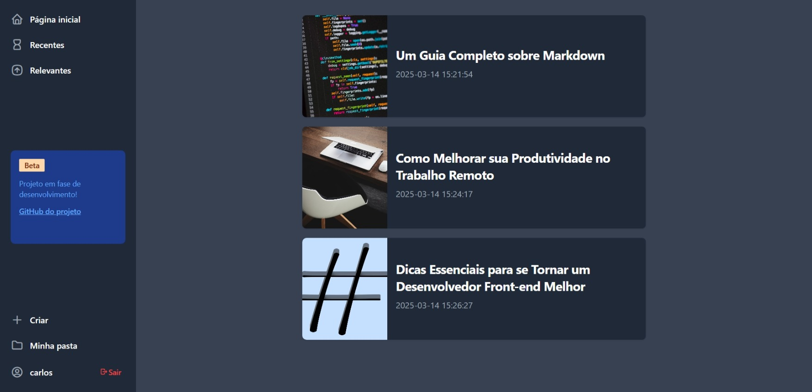
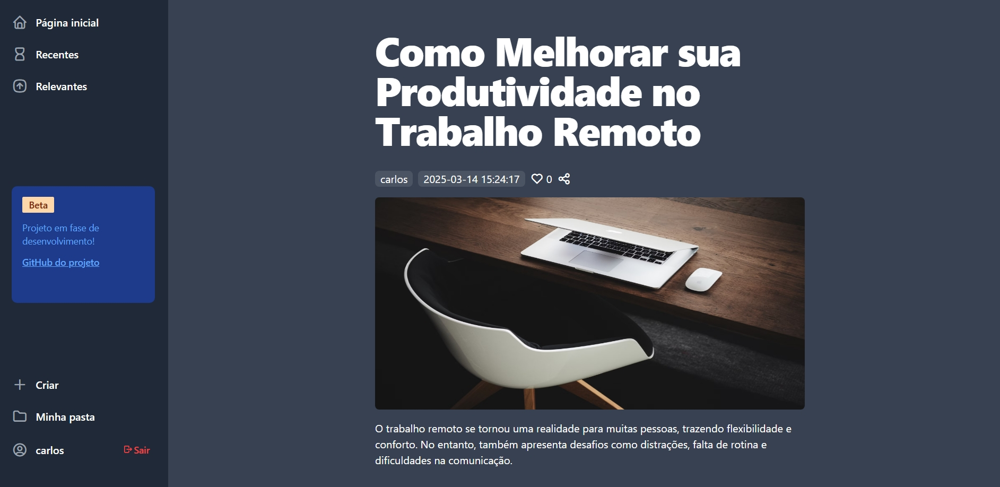
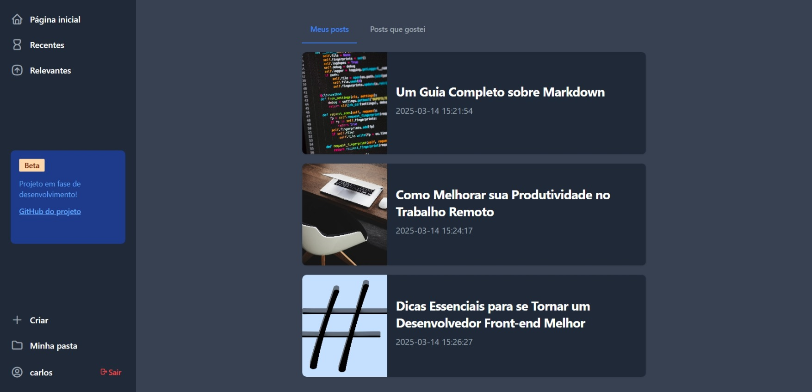
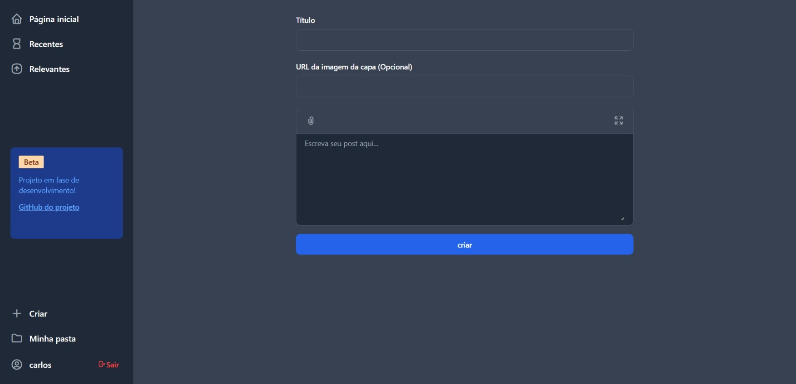
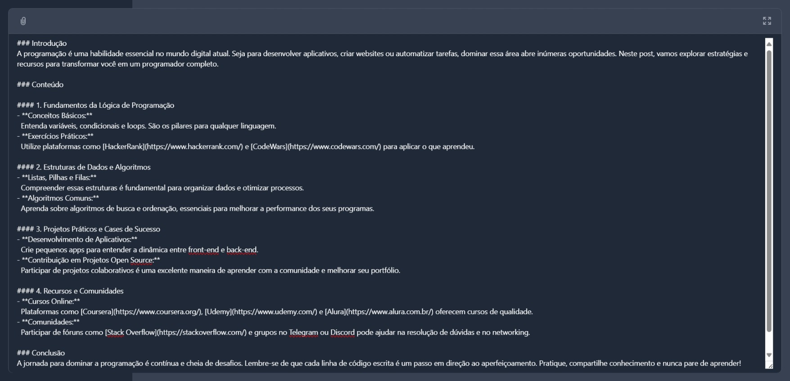
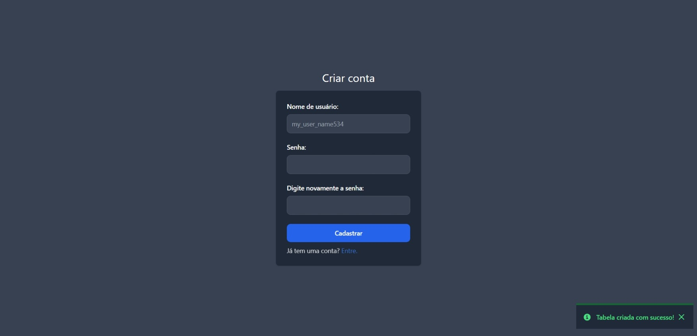
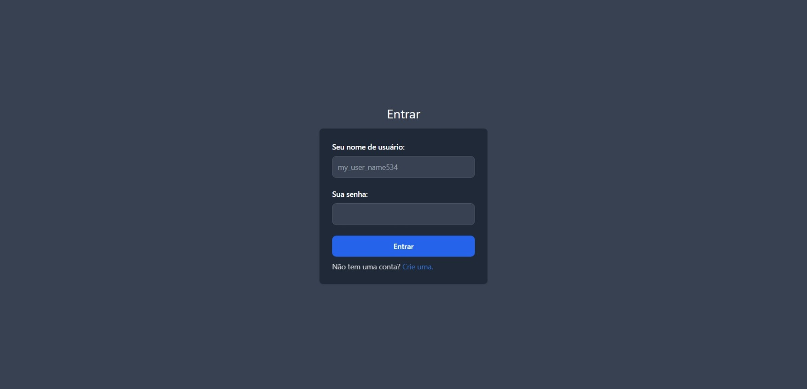

# md-posts

**md-posts** é um projeto de posts comunitários, onde os usuários podem criar conteúdos com suporte a Markdown.

## Funcionalidades Implementadas

- ✅ Suporte a posts em Markdown  
- ✅ Cadastro e login de usuários  
- ✅ Página de posts recentes  
- ✅ Sistema de curtidas 
- ✅ Página de posts relevantes   
- ✅ Área "Minha Pasta"

## Funcionalidades Pendentes

- ❌ Edição de posts  
- ❌ Exclusão de posts  

## Como Executar o Projeto

### 1. Configuração do Banco de Dados

1. Inicie um servidor MySQL (por exemplo, usando o XAMPP ou outro serviço de sua preferência).  
2. Crie uma base de dados. Por padrão, o projeto utiliza o banco de dados chamado `posts`. Caso deseje alterar o nome, crie um arquivo `.env` e defina `DB_NAME=nome_do_db`.

```sql
CREATE DATABASE posts;
```

### 2. Configuração das Variáveis de Ambiente

O projeto utiliza as seguintes variáveis de ambiente:

```env
DB_HOST=localhost
DB_NAME=posts
DB_USER=root
DB_PASS=
```

Caso queira alterar algum parâmetro, edite ou crie o arquivo `.env` na raiz do projeto.

### 3. Inicializando o Servidor PHP

Inicie um servidor PHP com o seguinte comando:

```bash
php -S localhost:8080
```

### 4. Acessando o Projeto

Abra seu navegador e acesse [http://localhost:8080](http://localhost:8080).

## Imagens do Projeto

### Página Inicial


### Visualização de Post


### Minha pasta


### Página de Criação de Post


### Criação de Post (Textarea)


### Página de Cadastro


### Página de Login
